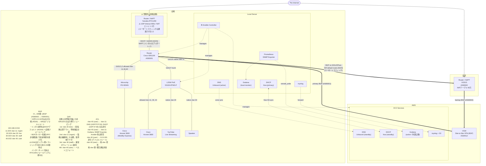

```mermaid
flowchart TB
 subgraph s1["自宅"]
        r1["Router / NAPT<br>IX3315<br>AS65002<br>NATテーブル 50万"]
  end
 subgraph server["Local Server"]
        dns["DNS<br>Unbound (active)"]
        dhcp["DHCP<br>Kea (primary)"]
        grafana_l["Grafana<br>(local monitor)"]
        snmp["Prometheus<br>SNMP Exporter"]
        syslog_l["rsyslog"]
        ansible_ctrl["⚙️ Ansible Controller"]
  end
 subgraph ec2["EC2 Services"]
        dns_a["DNS<br>Unbound (standby)"]
        dhcp_a["DHCP<br>Kea (standby)"]
        grafana_a["Grafana<br>(active / 外部公開)"]
        syslog_a["rsyslog + S3"]
  end
 subgraph AWS["AWS"]
        vgw["VGW<br>Site-to-Site VPN (BGP)<br>AS64512"]
        ec2
  end
 subgraph unmanaged["⚠️ 管理外 (会場設備)"]
        r2["Router / NAPT<br>Yamaha RTX1200<br>⚠️ UDP timeout 900s / NATエントリ 2万<br>(ユーザートラフィックは通過させない)"]
  end
 subgraph s2["会場"]
        n1["192.168.0.0/16<br>11.0/24 vlan 11: mgmt<br>20.0/24 vlan 20: live<br>30.0/24 vlan 30: staff<br>40.0/22 vlan 40: user"]
        n2["BGP<br>IX↔ISR間: eBGP (AS65002 ↔ AS65001)<br>・IXが0.0.0.0/0をeBGP広報 (AD20) → ISRのデフォルトルート<br>・トンネル断時はDHCPデフォルト (AD254) へ自動フォールバック<br>・BGPタイマー短縮 (RFC許容範囲) で収束時間を最小化<br>⚠️VGWはオンプレ間トランジット不可のためIX-ISR断時の<br>インターネット冗長はRTX1200フォールバックに委ねる"]
        n3["QoS<br>会場上流帯域が細いため ISR1100 の出力側でシェーピング<br>  1st: vlan 20 (live)  ─ 配信断は即アウト。帯域保証必須<br>  2nd: vlan 11 (mgmt)  ─ 監視は輻輳時こそ必要。低帯域で十分<br>  3rd: vlan 30 (staff) ─ 運営オペレーション維持<br>  4th: vlan 40 (user)  ─ ベストエフォート<br>"]
        n4["ACL<br>vlan 40 (user) → vlan 11: DNS (UDP/TCP 53), DHCP (UDP 67-68) のみ許可<br>vlan 40 (user) → vlan 11: Grafana, SNMP Exporter, Ansible 等は拒否<br>vlan 40 (user) → 0.0.0.0/0: 許可 (デフォルトルート)<br>vlan 40 (user) → 他 vlan: 拒否<br>他 vlan 間: 相互通信許容"]
        r3["Router<br>Cisco ISR1100<br>AS65001"]
        sw["L2SW PoE<br>S3100-8TMS-P"]
        poe["Microchip<br>PD-9004G"]
        ap1_2["Cisco<br>Aironet 3800<br>(Mobility Express)"]
        ap3_8["Cisco<br>Aironet 3800"]
        server
        unmanaged
        pc1["YouTube<br>Live Streaming"]
        pc3["Speaker"]
  end
    Internet(["The Internet"]) --> r1 & r2
    r2 -- DHCP / Gi0/0/0 AD254<br>NAPT (トンネルのアンダーレイ) --- r3
    r3 == BGP on IKEv2/IPsec<br>ISR default route (AD20)<br>(ユーザートラフィック) ==> r1
    r3 -- Gi0/1/7 trunk --- sw
    r3 -- Gi0/1/0 native vlan 11 --- server
    r3 -- Gi0/1/1,2 allowed vlan 11,30,40 --- poe
    poe --- ap1_2
    sw -- allowed vlan 11, 30, 40 --- ap3_8
    sw -- native vlan 20 --- pc1
    sw -- native vlan 30 --- pc3
    r3 == primary BGP (AS65001) ==> vgw
    r1 == backup BGP (AS65002) ==> vgw
    dhcp <-. Kea HA sync .-> dhcp_a
    dns -. zone sync .-> dns_a
    syslog_l -. forward .-> syslog_a
    snmp -. remote_write .-> grafana_a
    snmp -.-> grafana_l
    ansible_ctrl -. manages .-> r3 & sw & ec2

    n1@{ shape: text}
    n2@{ shape: text}
    n3@{ shape: text}
    n4@{ shape: text}
```